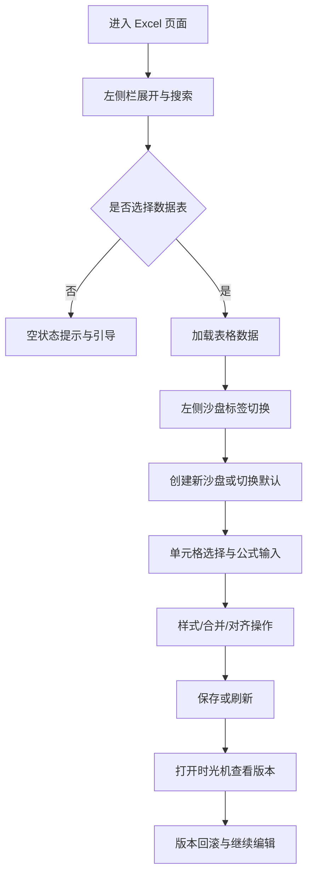

# 交互设计文档（深色科技感 Excel Demo）

## 用户流程

## 关键交互说明

- 悬停（Hover）
  - 左侧栏按钮与列表项在悬停时出现微弱外发光与浅色底纹，强调可点击。
  - 沙盘标签在悬停时提升亮度，并显示轻微描边。

- 点击（Click）
  - 左侧栏折叠按钮点击后平滑收起，核心区自适应拉伸。
  - 沙盘“创建”按钮点击后展示输入区，完成后自动回到标签列表。

- 加载中（Loading）
  - 顶部状态栏显示“加载中...”高亮文案，使用霓虹主色突出状态变化。
  - 左侧栏列表维持占位结构，避免闪跳。

- 弹层（Fx Suggestions/Popup）
  - 公式建议与函数列表弹层使用暗色半透明面板，边框与标题条使用强调色。
  - 弹层滚动保持内容可读性，选中项高亮。
