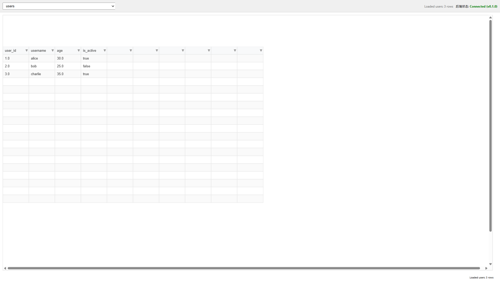
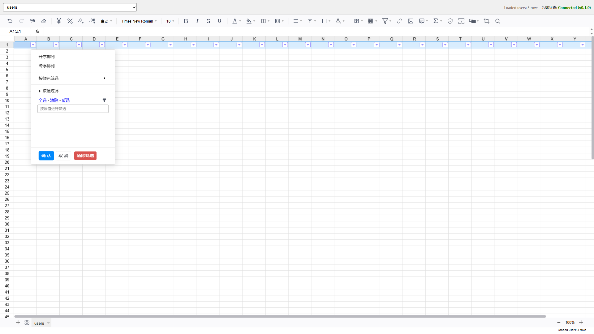

# Tabula Project

## 项目简介

这是一个基于 Rust 和 DataFusion 的 Tabula 查询引擎，支持对多种数据源（CSV, Excel, SQLite, Oracle, Parquet）进行统一 SQL 查询。项目采用 Rust Workspace 结构，旨在提供高性能的数据查询与缓存能力。

## 前端界面介绍

当前项目提供基于 React + Vite 的 Web 界面（`frontend/`），用于直接浏览后端查询结果。

### 界面截图

主界面（数据网格 + 会话栏 + 时光机侧栏）：



筛选交互（列筛选弹层）：



<details>
<summary><strong>前端功能清单（点击展开）</strong></summary>

- 后端健康状态检测与版本展示（`/api/health`）
- 数据表列表加载与切换（`/api/tables`）
- 查询执行与结果展示（`/api/execute`）
- 表格加载状态与调试信息展示
- 基于 `wasm_grid` 的结果网格渲染
- 前后端分离开发与 Vite 代理联调（`/api -> 3000`）

</details>

## 目录结构

```text
metadata/
├── docs/                    # [文档目录] 架构设计、压测报告、实施计划统一归档
├── federated_query_engine/  # [核心服务] Axum Web 服务器，包含查询逻辑、缓存管理、数据源实现
├── metadata_store/          # [基础库] 共享元数据存储逻辑 (本地依赖 crate)
├── wasm_grid/               # [前端网格引擎] Rust + WASM 渲染核心
├── src/                     # [根二进制] 元数据系统示例与入口
├── data/                    # [数据目录] 运行时数据占位（默认仅保留 .keep）
└── target/                  # [构建产物] 编译生成的可执行文件
```

> **[2026-03-08] 变更原因：目录结构与现状不一致；变更目的：开源发布前统一路径认知**

## 发布前清理范围

> **[2026-02-26] 变更原因：补齐发布前清理口径；变更目的：保证可删除/迁移项一致、可追溯**

| 路径 | 处理 | 依据 |
| :--- | :--- | :--- |
| `dist.zip` | 删除 | 由打包流程可再生成，非源码必要文件 |
| `winlibs.zip` | 删除 | 未被代码或文档引用，属于可再获取依赖 |
| `my_data.json` | 删除并忽略 | 运行时自动生成的本地数据文件 |
| `ARCHITECTURE_PLAN.md` | 迁移至 `docs/` | 设计类文档统一归档 |
| `doc/` | 删除 | 与 `docs/` 重复，统一以 `docs/` 为准 |
| `test_reports/` | 迁移至 `docs/` | 测试报告归档至文档目录 |
| `federated_query_engine/metrics_final.json` | 删除并忽略 | 性能报告中间产物，可再生成 |
| `federated_query_engine/performance_report.html` | 删除并忽略 | 性能报告产物，归档后可再生成 |
| `federated_query_engine/STRESS_TEST_REPORT.md` | 迁移至 `docs/` | 压测报告归档至文档目录 |

## 开发环境配置 (Windows)

### 1. 安装 Rust 工具链

推荐使用 `rustup` 在 Windows 上安装 Rust：

1.  访问 [rustup.rs](https://rustup.rs/) 下载 `rustup-init.exe`。
2.  运行安装程序，默认选择 **Installation Option 1 (Proceed with installation)**。
    *   这会安装 `stable-x86_64-pc-windows-msvc` 工具链。

### 2. 安装 C++ 构建工具

Rust 编译某些依赖（如 `ring`, `zstd` 等）需要 C 编译器。

1.  下载并安装 **Visual Studio Build Tools** (或 Visual Studio Community)。
2.  在安装选项中，勾选 **"使用 C++ 的桌面开发" (Desktop development with C++)** 工作负载。
    *   确保选中了 "MSVC v142/v143... build tools" 和 "Windows 10/11 SDK"。

### 3. (可选) 安装 Python

如果您需要运行 `generate_report.py` 生成性能图表，需要安装 Python 3.x。

## 快速上手

### 下载代码

```bash
git clone <repository_url>
cd metadata
```

### 首次运行

在根目录下执行：

```powershell
# 1. 自动下载依赖并构建（首次较慢）
cargo build

# 2. 启动后端服务（默认 3000 端口）
cargo run --bin tabula-server
```

服务启动后，默认监听 `0.0.0.0:3000`。

### 启动前端界面

在新的终端中执行：

```powershell
cd frontend
npm install
npm run dev
```

启动后访问 `http://localhost:5174`，页面会自动通过 `/api` 连接本地后端。

## 代码修改与贡献指南

如果您需要修改代码或参与开发，请遵循以下流程：

### 推荐工具

*   **编辑器**: VS Code
*   **插件**:
    *   **rust-analyzer**: 必须安装，提供极致的代码补全和跳转体验。
    *   **CodeLLDB**: 用于断点调试。
    *   **Even Better TOML**: 用于编辑 Cargo.toml。

### 常用命令

*   **运行单元测试**:
    ```powershell
    cargo test
    ```
*   **代码格式化** (提交前必跑):
    ```powershell
    cargo fmt
    ```
*   **代码检查** (查找潜在 bug):
    ```powershell
    cargo clippy
    ```

### 常见任务指南

1.  **添加新的数据源**:
    *   在 `federated_query_engine/src/datasources/` 下创建新文件。
    *   实现 `TableProvider` trait。
    *   在 `main.rs` 中注册新的文件类型。

2.  **修改缓存逻辑**:
    *   核心逻辑位于 `federated_query_engine/src/cache_manager.rs`。
    *   如果修改了缓存结构，请运行 `cargo test cache_stress_test` 验证并发安全性。

3.  **调试**:
    *   在 VS Code 中按 `F5` 即可启动调试（需自动生成 launch.json 配置）。

## 常见问题

*   **Q: 编译时提示 `link.exe` not found?**
    *   A: 说明缺少 Visual Studio C++ Build Tools，请参考上文“安装 C++ 构建工具”一节。

*   **Q: 如何开启 Oracle 支持?**
    *   A: 默认关闭。如需开启，需安装 Oracle Instant Client，并运行 `cargo run --features oracle`。

