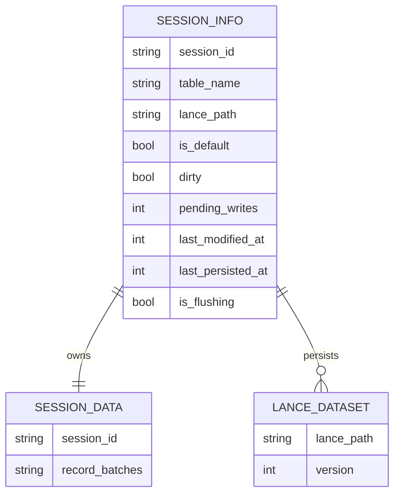
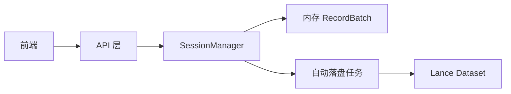
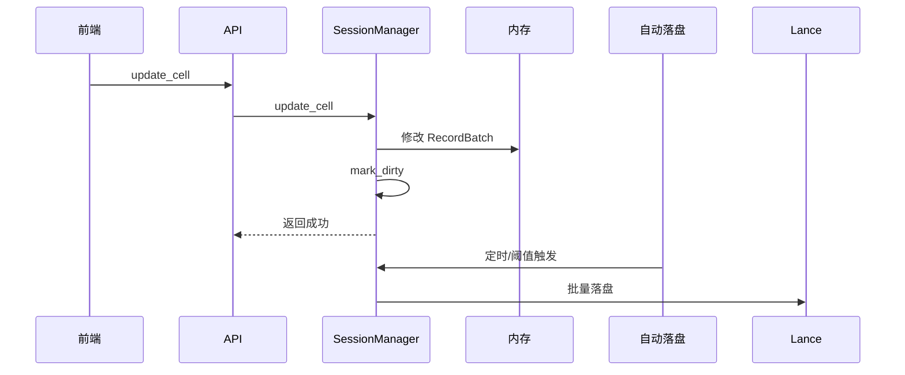
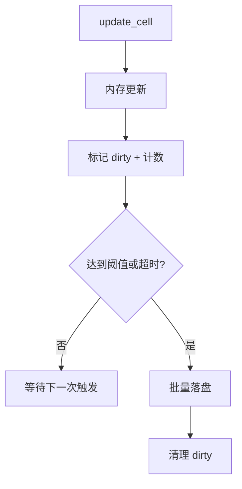
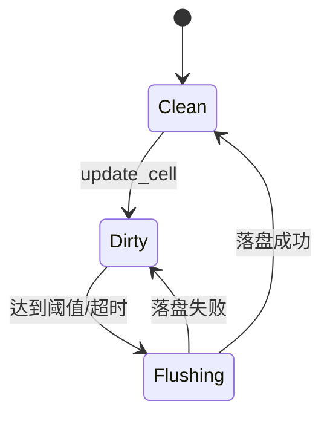

# 数据更新与保存逻辑（更新/保存链路）

本报告用于说明数据编辑、会话管理与持久化的端到端架构与流程。

## 1. 核心架构：内存优先
系统采用“内存编辑、显式保存”的策略来保障性能与稳定性。

*   **编辑（RAM）**：所有单元格更新都在内存中的 Arrow RecordBatches 上完成（`SessionManager` 管理）。
*   **查询（RAM）**：全局查询引擎（`SessionContext`）通过 `MemTable` 直接指向内存批数据。
*   **持久化（磁盘）**：仅在用户触发“保存”时把数据写回 Lance 文件。
*   **依赖关系与执行顺序**：Lance 依赖 Arrow。加载流程为先从 Lance 读入内存，再在内存中通过 Arrow 进行编辑与查询；页面交互不直接操作 Lance 文件。

## 2. 详细数据流

### A. “更新单元格”链路（编辑）
当用户编辑单元格时，流程如下：

1.  **前端请求**：
    *   发送 `POST /api/update_cell`，包含 `{ row_idx, col_name, new_value }`。

2.  **后端处理（`src/main.rs` -> `src/session_manager/mod.rs`）**：
    *   **步骤1：定位会话**：`SessionManager` 获取活动会话的内存数据（`Arc<RwLock<Vec<RecordBatch>>>`）。
    *   **步骤2：Schema 演进**：
        *   若 `col_name` 为新列，则动态扩展 Arrow Schema 并给已有批次填充 `null`。
    *   **步骤3：内存更新**：
        *   定位目标 `RecordBatch`。
        *   重建列数组并写入 `new_value`（含 Int/Float/Boolean 类型转换）。
        *   更新内存 `current_data`。
    *   **步骤4：注册到上下文（保证查询回显）**：
        *   `main.rs` 中的 `update_cell` 调用 `session_manager.register_session_to_context`。
        *   先从 `SessionContext` 注销旧表，再注册新的 `MemTable` 指向最新内存批。
        *   结果：后续 SQL 查询立即看到新数据。

3.  **响应**：
    *   返回 JSON `{ status: "ok", ... }`。

### B. “保存”链路（持久化）
当用户点击“保存”时：

1.  **前端请求**：
    *   发送 `POST /api/save_session`，包含 `{ table_name }`。

2.  **后端处理**：
    *   **步骤1：读取内存**：`SessionManager` 锁定内存中的 `RecordBatch`。
    *   **步骤2：写入磁盘**：
        *   初始化 Lance Dataset 写入器。
        *   将批数据写入会话路径（如 `data/sessions/table_uuid`）。
        *   在磁盘上生成或覆盖物理文件。

### C. “加载/切换”链路
1.  **切换会话**：
    *   `SessionManager` 从磁盘读取 Lance 文件到内存（`current_data`）。
    *   随后把内存数据注册到 `SessionContext`。
    *   补充：页面交互与查询都基于内存中的 Arrow 数据结构，不会直接对 Lance 文件进行原地操作。

## 3. ⚠️ 读取路径与逻辑偏差（与“设计预期”的差异）
**结论**：当前实现确实会在读取链路中把 Lance 加载到 Arrow 内存，这个逻辑已经存在且会在内存缺失时触发。

### 偏差 1：内存更新不是“永远内存”
*   设计目标是“写入只在 Arrow 内存”，但代码在任意缺失内存时都会回读 Lance。
*   这意味着 Lance 是强依赖，不是可选落盘。

### 偏差 2：注册数据源依赖 Lance 完整性
*   `register_session_to_context` 在内存缺失时同样会从 Lance 补加载。
*   Lance 缺失时，查询路径会降级为旧数据或失败，日志中会提示使用原始数据。

### 偏差 3：session 元数据与磁盘目录可能不同步
*   只要 metadata 中的 `session.lance_path` 指向不存在目录，就会触发加载失败。
*   这会在切换会话、注册表或保存前加载时复现。

### 结论与处理方向
*   读取路径已包含“Lance → Arrow”的补加载逻辑，但属于被动触发。
*   为避免缺失导致的失败，应在会话激活或注册前做路径存在性校验，并优先走按需加载与降级策略。

## 4. 代码位置
*   **更新逻辑**：`SessionManager::update_cell`（[mod.rs](file:///d:/Rust/metadata/federated_query_engine/src/session_manager/mod.rs)）
*   **注册逻辑**：`SessionManager::register_session_to_context`（[mod.rs](file:///d:/Rust/metadata/federated_query_engine/src/session_manager/mod.rs)）
*   **API 处理**：`update_cell`（[main.rs](file:///d:/Rust/metadata/federated_query_engine/src/main.rs)）

## 5. 持久化策略升级（方案A）

**目标**：更新只落内存，异步或批量触发落盘，避免每次 `update_cell` 触发 `Overwrite`。

### 5.1 数据架构

### 5.2 应用架构

### 5.3 交互序列

### 5.4 业务流程

### 5.5 状态机

### 5.6 结果预期
*   减少每次更新触发的磁盘重写
*   大对象更新耗时下降（IO 聚合）
*   保留最终一致性，支持显式保存

## 6. Lance 文件超出可用内存的处理方案（结合现有代码）
现有实现以“内存为主、落盘为辅”为核心，会话在编辑时需要内存持有 RecordBatch。为避免 Lance 数据集超过可用内存导致加载失败或进程被杀，需要在加载与编辑链路上增加约束与降级策略：

### 6.1 关键风险点
*   **加载风险**：切换会话或首次编辑时，会从 Lance 读入内存；若全量加载超出内存会失败。
*   **保存风险**：保存时默认写回完整批数据，内存压力和 IO 压力会放大。

### 6.2 约束与降级策略
1.  **加载前内存预算检查**：
    *   读取 Lance 数据集的行数、列数或文件体积，粗估加载所需内存。
    *   若估算值超过可用内存阈值，禁止全量加载，进入“按需加载”模式。

2.  **按需加载（窗口化 + 分批）**：
    *   只加载当前可视范围或指定行区间的数据批次。
    *   后续滚动或查询再按批补充加载，避免一次性全量读入。

3.  **列裁剪与投影下推**：
    *   加载时仅取当前展示所需列，减少内存占用。
    *   计算类查询按需投影列，避免全表列加载。

4.  **冷热分离与自动卸载**：
    *   超出阈值时，释放不活跃会话或历史批次的内存副本。
    *   再次访问时从 Lance 重新加载对应批次。

5.  **编辑缓冲与批量落盘**：
    *   编辑先进入内存缓冲区，达到阈值或定时批量写回 Lance。
    *   降低频繁全量写回造成的 IO 抖动。

### 6.3 避免问题发生的落地原则
*   默认禁止超内存全量加载，必须走“预算检查 + 按需加载”。
*   对外暴露最大内存上限配置，超过阈值直接降级为窗口化数据访问。
*   保存操作与内存缓存解耦，优先保证服务稳定而非强制全量写回。
