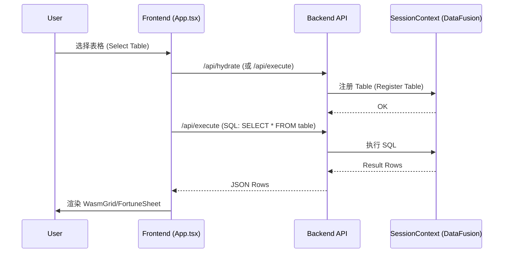
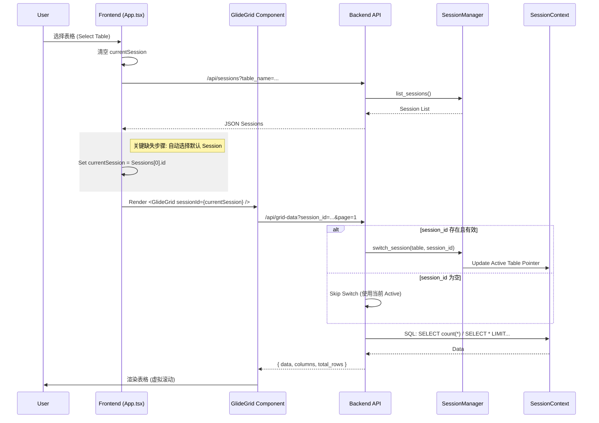

# 数据流与连接方式对比 (Old vs New)

## 1. 旧版流程 (Wasm/FortuneSheet)
**特点**: 单一会话，隐式状态，依赖全局 `SessionContext`。

## 2. 新版流程 (Glide Data Grid + Multi-Session)
**特点**: 多会话支持，显式 Session ID，分页加载，依赖 `SessionManager`。

## 当前问题分析
1. **Frontend**: `App.tsx` 在切换表格时清空了 `currentSession`，但获取到 Session 列表后没有自动选中一个默认的。
2. **Backend**: `GlideGrid` 发送了空的 `session_id` (或无效的)，后端尝试 `switch_session` 失败，返回 "Session not found"。

## 解决方案
1. **后端优化**: 允许 `/api/grid-data` 的 `session_id` 为空（若为空则不切换，使用默认）。
2. **前端优化**: 加载 Session 列表后，默认选中第一个（最新的）Session。
