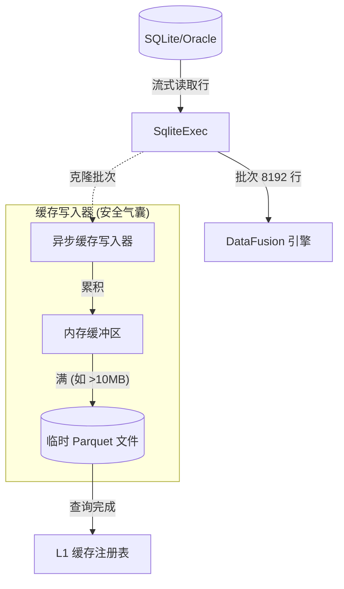

# 数据库 L1 缓存策略设计文档

## 1. 背景与目标
当前，联邦查询引擎 (Federated Query Engine) 通过 `SqliteExec` 直接查询数据库（如 SQLite）。虽然功能正常，但在重复查询或大数据量拉取时，性能和资源消耗较大。

我们的目标是为数据库查询引入 **L1 Parquet 缓存** 层，并满足以下要求：
1.  **非阻塞 (Non-blocking)**：缓存过程必须异步进行，绝不能降低当前查询的效率。
2.  **空间效率 (Space Efficiency)**：使用 LRU 淘汰策略，防止撑爆硬盘空间。
3.  **预取机制 (Prefetching)**：能够机会性地拉取比请求更多的数据（如相邻时间范围）以预热缓存。
4.  **安全气囊 (Safety Airbag)**：防止在生成缓存时发生 OOM（内存溢出）。数据应在内存中分批处理，一旦达到阈值（如 8192 行）即刻追加写入磁盘（Parquet 文件），而不是全部堆积在内存。

## 2. 架构概览

核心思想是在数据流中引入 **"Tee" (分流/侧车)** 机制。

### 2.1 "侧车" (Sidecar) 模式与资源权衡 (Resource Trade-off)
用户提出了一个关键问题：**既然已经分批读取，是否可以直接串行处理，避免分流带来的资源开销？**

我们进行了详细的对比分析：

| 模式 | 流程 | 延迟 (Latency) | 风险 |
| :--- | :--- | :--- | :--- |
| **A. 串行模式** | `读DB -> 压缩/写Parquet -> 发送给用户` | **高** (读耗时 + 写耗时) | 写磁盘/压缩阻塞查询，违背"不影响效率"原则 |
| **B. 分流模式** | `读DB -> 发送给用户`   `└-> (异步) 压缩/写Parquet` | **低** (仅读耗时) | 队列积压可能占用内存 |

**决策**：
为了严格遵守 **"1. 不会影响当前查询效率"** 的要求，**分流是必须的**。
因为 Parquet 写入不仅涉及 I/O，还涉及大量的 **CPU 计算 (Snappy/Zstd 压缩)**。如果在主线程执行，查询速度将直接下降 30%-50%。

**资源控制优化**：
为了回应"分流占用资源"的担忧，我们引入 **"有界丢弃 (Bounded Drop)"** 策略：
1.  `cache_tx` 通道容量设为极小 (如 5 个 batch)。
2.  **背压策略**：如果缓存写入太慢导致通道满了，**直接丢弃 (Drop)** 当前 batch 的缓存任务。
3.  **结果**：
    - **内存安全**：绝不会有超过 5 个 batch 积压在内存中。
    - **查询优先**：宁可不生成缓存，也不能阻塞用户查询。
    - **零拷贝**：`RecordBatch` 的 Clone 是基于 `Arc` 的浅拷贝，开销几乎为零。

## 3. 详细设计

### 3.1 触发点 (Trigger Point)
修改 `src/datasources/sqlite.rs` -> `read_sqlite_data`。
- **当前**：读取行 -> 构建 Batch -> 发送给 `tx`。
- **新流程**：读取行 -> 构建 Batch -> 发送给 `tx` **同时** 发送给 `cache_tx`。

`cache_tx` 将是一个无界或大缓冲区的通道，连接到一个专用的异步任务。如果通道已满（背压），我们可以选择直接丢弃缓存请求（Fail Open），而不是拖慢用户查询。

### 3.2 安全气囊 (增量 Parquet 写入)
为了防止缓存 100GB 表时发生 OOM：
1.  **追加模式 (Append Mode)**：我们不能等待所有结果集就绪才写一个巨大的 Parquet 文件。
2.  **分块写入 (Chunked Writing)**：
    - `CacheWriter` 持有一个指向临时文件（如 `cache_staging/query_id.parquet`）的 `ArrowWriter`。
    - 每当收到一个 batch，立即将其写入 Parquet 文件（或稍作缓冲以对齐块大小）。
    - **关键点**：虽然 Parquet 文件一旦关闭就不可变，但 `ArrowWriter` 支持在关闭前流式写入。我们保持 Writer 打开直到流结束。
    - **内存占用**：同一时间内存中只有 1 个 batch（8192 行）。

### 3.3 缓存键与存储
- **键 (Key)**：Hash(SQL 查询语句 + 参数) 或 表名 + 谓词。
    - *决策*：针对全表扫描，使用 **表级缓存**；针对特定查询，使用 **谓词缓存**。
    - *细化*：如果查询是 `SELECT * FROM table`，缓存整表。如果是 `SELECT * FROM table WHERE id > 100`，缓存该片段。
- **位置**：`cache/l1/{hash}.parquet`

### 3.4 LRU-K 淘汰策略 (修改版)
我们需要一个定制的 LRU。

**标准 LRU**：淘汰最久未使用的。
**问题**：抗扫描能力弱 (Scan-resistant)。一次性的大查询会冲刷掉所有有用的热数据。
**解决方案**：**LRU-K (K=2)** 或 **W-TinyLFU**。

**建议公式 (应要求列出)**：
我们维护两个队列：
1.  **历史队列 (A1)**：存放初次被访问的数据。短 TTL。
2.  **主队列 (Am)**：存放频繁访问的数据（至少访问 K 次）。

**算法逻辑**：
1.  **当访问数据 X 时**:
    - 如果 X 在 Am 中 -> 移至 Am 的 MRU (最近使用端)。
    - 如果 X 在 A1 中 -> 移至 Am 的 MRU (晋升为热数据)。
    - 如果 X 是新的 -> 加入 A1 的 MRU。
2.  **当需要淘汰时**:
    - 如果 Size(A1) > 阈值 -> 淘汰 A1 的 LRU (最久未使用端)。
    - 否则 -> 淘汰 Am 的 LRU。
    - *约束*：总文件大小 < 最大磁盘配额 (如 10GB)。

### 3.5 预取策略 (Prefetching)
- **被动 (Passive)**：查询什么，缓存什么。
- **主动 (Active - 未来规划)**：如果查询是 `time > '2023-01-01'`，后台异步拉取 `time > '2022-12-01'`（相邻范围）以预热。
- *实现*：这需要分析 SQL WHERE 子句。第一阶段我们专注于 **被动缓存**（精确缓存查询结果），但采用支持追加的结构。

## 4. 实施步骤 (草案)

1.  **缓存管理器更新 (Cache Manager)**：
    - 添加 `CacheWriter` 结构体，接收 `RecordBatch` 流。
    - 实现 `ArrowWriter` 循环以进行追加写入。
    - 实现 `finalize()` 将临时文件移动到永久缓存目录。

2.  **淘汰管理器 (Eviction Manager)**：
    - 内存结构体跟踪文件使用情况。
    - `access(key)` 方法。
    - `enforce_limit()` 方法用于删除文件。

3.  **Sqlite 集成**:
    - 在 `read_sqlite_data` 中，生成 `CacheWriter` 任务。
    - 将 batches 发送给它。

## 5. 风险评估
- **磁盘 I/O 争用**：读 SQLite 的同时也写 Parquet 可能会占满磁盘 I/O。
    - *缓解*：以低优先级运行 CacheWriter，或进行限流。
- **数据一致性**：如果 DB 变更了怎么办？
    - *策略*：缓存文件设置 TTL（生存时间，如 5 分钟）。简单的失效机制。
