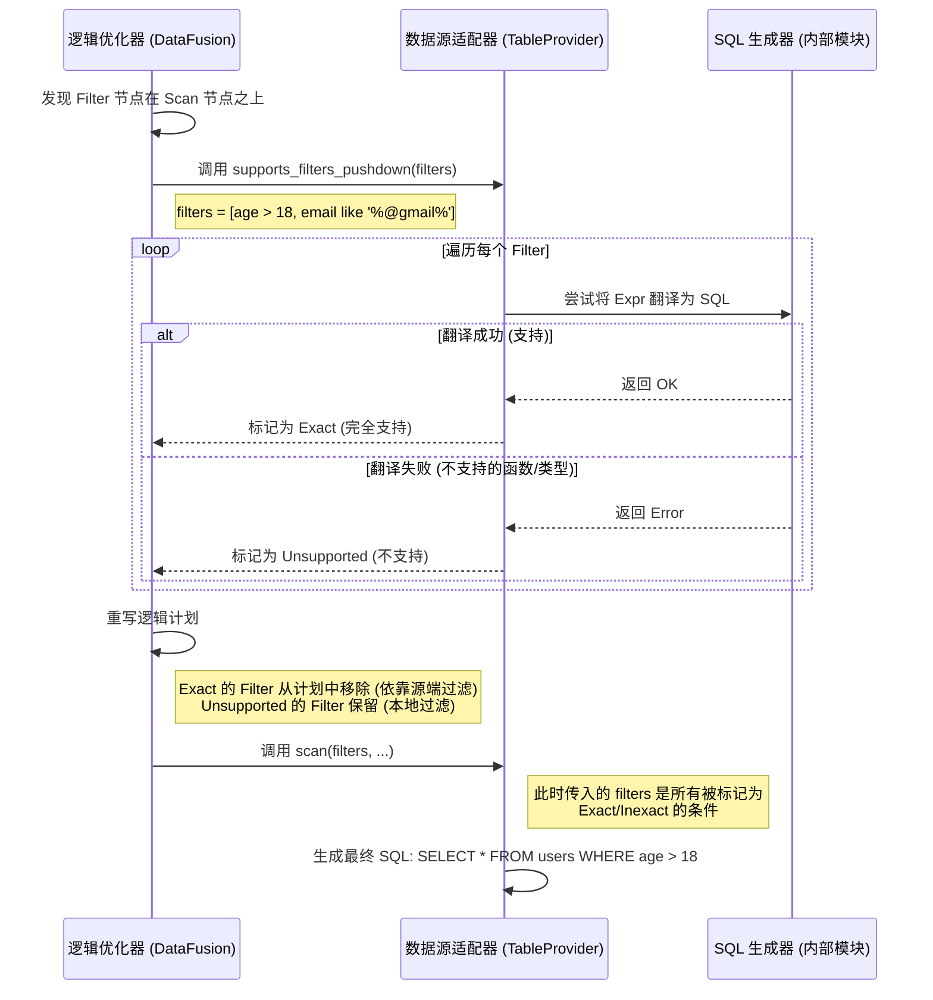

# Rust 联邦查询引擎高阶设计方案

## 1. 核心架构与开源组件选型

为了避免重复造轮子，我们基于 Rust 生态中最成熟的 **Apache Arrow** 和 **DataFusion** 体系来构建。

### 1.1 核心组件选型

| 组件层级 | 推荐选型 | 理由 |
| :--- | :--- | :--- |
| **查询计算引擎** | **Apache DataFusion** | Rust 领域的事实标准。基于 Arrow 内存模型，提供 SQL 解析、逻辑计划、物理计划、优化器。原生支持联邦查询接口 (`TableProvider`)。 |
| **内存数据格式** | **Apache Arrow** | 列式内存格式，零拷贝特性，非常适合大规模数据分析和传输。 |
| **异步运行时** | **Tokio** | Rust 最强大的异步运行时，处理高并发 I/O (连接多个数据源) 必选。 |
| **RPC/API 接口** | **Tonic (gRPC)** / **Axum (HTTP)** | 用于对外提供查询服务。 |
| **数据源连接** | **sqlx** (SQL DBs), **reqwest** (REST APIs), **object_store** (S3/HDFS) | 针对不同数据源的底层驱动。 |

### 1.2 架构图 (Mermaid)

```mermaid
graph TD
    Client[客户端 SQL] --> API[API Layer (Axum/Tonic)]
    API --> Planner[DataFusion SQL Planner]
    Planner --> Optimizer[逻辑优化器]
    Optimizer --> Executor[物理执行引擎]
    
    subgraph CatalogManager [元数据管理]
        SchemaReg[Schema 注册中心]
        Stats[统计信息]
    end
    
    Executor -->|Scan| Connectors[数据源连接器层]
    
    subgraph Connectors
        MySQL[MySQL Connector]
        Postgres[Postgres Connector]
        API_Source[REST API Source]
    end
    
    Planner -.-> CatalogManager
    Connectors -->|Arrow RecordBatch| Executor
```

---

## 2. 关键设计点

### 2.1 父类与子类设计 (Traits vs Inheritance)

Rust 没有传统的类继承 (Class Inheritance)，而是使用 **Trait (特征)** 和 **组合 (Composition)**。在 DataFusion 体系下，核心的抽象是 `TableProvider`。

*   **"父类" (Trait 接口)**: 定义所有数据源必须具备的行为。
    *   **核心 Trait**: `TableProvider` (DataFusion 提供)
    *   **职责**:
        *   `schema()`: 返回数据源的结构 (Arrow Schema)。
        *   `scan()`: 执行扫描，返回数据流。
        *   `supports_filters_pushdown()`: 询问是否支持谓词下推。

*   **"子类" (具体实现 Struct)**: 针对不同数据源的实现。
    *   **Struct**: `PostgresTable`, `MysqlTable`, `CsvTable`。
    *   **实现方式**: 这些 Struct 内部包含连接池 (如 `sqlx::Pool`)，并实现 `TableProvider` trait。

**代码设计示例**:

```rust
use async_trait::async_trait;
use datafusion::datasource::TableProvider;
use datafusion::physical_plan::ExecutionPlan;
// ... 其他导入

/// 通用数据源上下文 (相当于基类的数据部分)
struct DataSourceContext {
    name: String,
    schema: SchemaRef,
}

/// Postgres 数据源实现 (相当于子类)
struct PostgresDataSource {
    ctx: DataSourceContext, // 组合通用部分
    pool: sqlx::PgPool,     // 特有部分：连接池
}

#[async_trait]
impl TableProvider for PostgresDataSource {
    fn as_any(&self) -> &dyn Any { self }
    
    fn schema(&self) -> SchemaRef {
        self.ctx.schema.clone()
    }

    async fn scan(&self, state: &SessionState, projection: Option<&Vec<usize>>, filters: &[Expr], ...) -> Result<Arc<dyn ExecutionPlan>> {
        // 1. 将 filters 转换为 SQL WHERE 子句
        // 2. 构建 SQL 查询
        // 3. 返回一个能够流式读取 SQL 结果的 ExecutionPlan
    }
}
```

### 2.2 连接器的内存管理 (Connector Memory Management)

联邦查询最忌讳将远端数据全部加载到内存。

*   **流式处理 (Streaming)**:
    *   连接器**不应该**返回 `Vec<Row>`，而应该返回 `SendableRecordBatchStream` (异步迭代器)。
    *   **Batching**: 数据以 `RecordBatch` (比如每批 4096 行) 的形式在管道中传输。
    *   **Backpressure**: 利用 Tokio 的异步通道机制，如果上游处理慢，下游读取也会变慢，防止 OOM (内存溢出)。

*   **Zero-Copy (零拷贝)**:
    *   从网络读取字节流后，尽量直接反序列化为 Arrow 格式。
    *   使用 `Arc<Array>` 在不同算子间共享数据所有权，避免数据复制。

### 2.3 谓词下推深度解析 (Deep Dive into Predicate Pushdown)

这是联邦查询引擎最核心的性能优化机制。如果无法有效下推过滤条件，引擎将不得不把远程表的全量数据拉取到本地进行过滤，这通常是不可接受的。

#### 2.3.1 核心流程：服务端如何判断源端能力？

**关键点**：判断逻辑发生在 **查询规划阶段 (Planning Phase)**，而不是执行阶段。
服务端（联邦引擎）持有各个数据源的适配器实例（即实现了 `TableProvider` 的结构体）。当 SQL 被解析为逻辑计划后，DataFusion 的优化器会遍历计划树，找到扫描节点 (`TableScan`)，并主动询问该节点对应的适配器。

**交互流程图**:



#### 2.3.2 状态返回值详解

`TableProvider::supports_filters_pushdown` 方法对每个传入的过滤条件返回以下三种状态之一：

1.  **`TableProviderFilterPushDown::Exact` (完全下推)**
    *   **含义**: 数据源承诺：我能完美处理这个过滤条件，返回的数据**一定**是满足条件的。
    *   **引擎行为**: 优化器会将该 Filter 从本地执行计划中**移除**。
    *   **场景**: 标准 SQL 比较 (`>`, `=`, `<`), 标准逻辑运算 (`AND`, `OR`).
    *   **收益**: 最大化。减少网络传输，减少本地 CPU 计算。

2.  **`TableProviderFilterPushDown::Inexact` (部分下推/不精确下推)**
    *   **含义**: 数据源说：我可以利用这个条件过滤掉一部分数据，但我**不能保证**返回的数据全都是对的（可能会有漏网之鱼）。
    *   **引擎行为**: 优化器会将该 Filter **保留**在本地执行计划中。源端过滤后的数据到达本地后，会被再次过滤。
    *   **场景**:
        *   **Bloom Filter**: 只能通过布隆过滤器排除不存在的，但存在的可能是假阳性。
        *   **大小写敏感性差异**: 比如源端数据库不区分大小写，但用户查询要求区分大小写。源端先按不区分大小写过滤一遍（减少数据量），本地再严格过滤一遍。
    
3.  **`TableProviderFilterPushDown::Unsupported` (不支持)**
    *   **含义**: 数据源说：我不认识这个操作符，或者我的列没有索引，我不做处理。
    *   **引擎行为**: 优化器保留该 Filter。数据源进行全表扫描（或者只应用其他支持的 Filter），所有数据传输到本地后，由本地引擎进行过滤。
    *   **场景**:
        *   **复杂 UDF**: 本地注册了 Rust 自定义函数 `my_complex_func(col)`，远端 MySQL 根本没有这个函数。
        *   **跨表计算**: 涉及本地其他表数据的过滤条件。

#### 2.3.3 实现示例 (Rust)

```rust
// 伪代码：在 TableProvider 实现中
fn supports_filters_pushdown(&self, filters: &[&Expr]) -> Result<Vec<TableProviderFilterPushDown>> {
    let mut results = vec![];
    
    for expr in filters {
        // 尝试将 DataFusion 的 Expr 转换为 SQL 字符串
        match sql_generator::expr_to_sql(expr) {
            Ok(_) => {
                // 如果能成功翻译成 SQL，我们就认为可以“精确”下推
                results.push(TableProviderFilterPushDown::Exact);
            },
            Err(_) => {
                // 翻译失败（可能包含不支持的函数），只能本地过滤
                results.push(TableProviderFilterPushDown::Unsupported);
            }
        }
    }
    
    Ok(results)
}
```

#### 2.3.4 深入 SQL 生成器内部：方言抽象与上下文感知 (Dialect Abstraction & Context Awareness)

你提到了一个非常关键的问题：**上下文丢失**。单纯的 `expr_to_sql` 函数是无法工作的，因为它不知道目标是 MySQL 5.7 还是 PostgreSQL 14，也不道源端是否安装了某些插件。

为了解决这个问题，我们需要引入 **`SQLDialect` (方言)** 抽象层，并将它绑定到具体的 `TableProvider` 上。

**1. 架构设计：谁持有上下文？**

*   **`TableProvider` 实例**：代表一个具体的物理表（例如 `mysql_prod_users`）。它持有该数据源的配置信息，包括**方言实现 (Dialect)**。
*   **`SQLDialect` Trait**：定义了“如何生成 SQL”以及“支持哪些特性”的标准接口。

**2. 核心代码结构 (Rust)**

我们不再使用全局的静态函数，而是定义一个 Trait：

```rust
/// 定义不同数据源的方言行为
pub trait SqlDialect: Send + Sync {
    /// 1. 基础能力检查
    /// 用于快速判断某个函数是否在当前版本可用
    fn supports_scalar_function(&self, name: &str) -> bool;

    /// 2. 核心翻译逻辑
    /// 接收 Expr，结合自身的方言规则生成 SQL
    fn expr_to_sql(&self, expr: &Expr) -> Result<String>;
    
    /// 3. 标识符引用 (处理 `id` vs "id" vs [id])
    fn quote_identifier(&self, id: &str) -> String;
}

/// MySQL 方言实现 (支持版本控制)
pub struct MySqlDialect {
    pub version: Version, // e.g., 8.0.23
}

impl SqlDialect for MySqlDialect {
    fn supports_scalar_function(&self, name: &str) -> bool {
        match name {
            // 只有 MySQL 8.0+ 才支持窗口函数或其他新特性
            "rank" | "dense_rank" => self.version.major >= 8,
            "abs" | "length" => true, // 基础函数总是支持
            _ => false,
        }
    }

    fn expr_to_sql(&self, expr: &Expr) -> Result<String> {
        // ... 具体实现，调用 self.quote_identifier 等 ...
    }
}
```

**3. 工作流程：上下文如何传递？**

当 DataFusion 优化器调用 `TableProvider::supports_filters_pushdown` 时，流程如下：

1.  **优化器** 找到 `Scan: mysql_prod_users` 节点。
2.  **优化器** 调用 `mysql_prod_users.supports_filters_pushdown(filters)`。
3.  **`mysql_prod_users` (TableProvider)** 内部持有 `Arc<MySqlDialect>`。
4.  它将 `filters` 和 **自己的方言实例** 传给翻译器：`self.dialect.expr_to_sql(expr)`。
5.  **`MySqlDialect`** 根据自己的版本配置，判断是否支持该表达式。

**4. 应对版本升级 (Versioning & Discovery)**

针对“数据源换新版本”的问题，我们有动态探测机制：

*   **握手阶段探测 (Handshake Discovery)**:
    当联邦引擎启动并连接到数据源时，首先执行 `SELECT VERSION()`。
*   **自动配置**:
    根据返回的版本号，实例化带有不同配置的 `MySqlDialect`。
    *   如果版本 >= 8.0，开启 `WindowFunction` 支持开关。
    *   如果版本 < 5.7，禁用 `JSON` 相关函数支持。

```mermaid
graph TD
    Start[启动连接器] --> Connect[建立 TCP 连接]
    Connect --> VersionCheck[执行 SELECT VERSION()]
    VersionCheck -->|Output: 8.0.32| Config8[初始化 MySqlDialect { version: 8.0 }]
    VersionCheck -->|Output: 5.6.10| Config5[初始化 MySqlDialect { version: 5.6 }]
    
    Config8 --> Provider[注入 TableProvider]
    Config5 --> Provider
    
    Provider -->|Planning| Pushdown[谓词下推检查]
    Pushdown -->|Delegate| Dialect[调用 Dialect.expr_to_sql]
```

通过这种方式，`sql_generator` 不再是盲目的翻译机器，而是变成了一个**具备版本感知能力、绑定具体数据源上下文**的智能组件。

#### 2.3.5 复杂方言案例分析：Oracle 的多版本适配 (Complex Dialect Case Study: Oracle)

Oracle 是一个典型的“版本割裂”严重的数据库。不同版本对核心语法的支持差异巨大（例如分页和聚合）。为了优雅处理这种情况，我们引入 **能力矩阵 (Capability Matrix)** 模式。

**1. 定义能力集 (Capabilities)**

不再仅仅存储一个版本号，而是将版本号解析为一组细粒度的布尔开关 (Feature Flags)。

```rust
struct OracleCapabilities {
    use_fetch_first: bool, // 12c+ 支持 OFFSET FETCH
    use_listagg: bool,     // 11gR2+ 支持 LISTAGG
    native_json: bool,     // 12c+ 支持 JSON
}

impl From<Version> for OracleCapabilities {
    fn from(v: Version) -> Self {
        Self {
            use_fetch_first: v.major >= 12,
            use_listagg: v.major >= 11 && v.minor >= 2,
            native_json: v.major >= 12,
        }
    }
}
```

**2. 差异化 SQL 生成**

在 `expr_to_sql` 或 SQL 构建过程中，根据能力开关选择不同的生成策略。

*   **场景 A: 分页 (Limit/Offset)**
    *   **Oracle 12c+**: 生成标准 SQL `OFFSET 10 ROWS FETCH NEXT 5 ROWS ONLY`。
    *   **Oracle 11g**: 必须退化为嵌套的 `ROWNUM` 子查询。

```rust
impl SqlDialect for OracleDialect {
    fn generate_limit_offset(&self, limit: Option<usize>, offset: usize) -> String {
        if self.caps.use_fetch_first {
            // 现代写法 (12c+)
            format!("OFFSET {} ROWS FETCH NEXT {} ROWS ONLY", offset, limit.unwrap_or(u64::MAX as usize))
        } else {
            // 传统写法 (11g) - 需要在最外层包装子查询，逻辑较复杂，
            // 通常建议在 LogicalPlan 转换阶段就处理成不同的结构
            panic!("Oracle 11g pagination requires subquery rewrite, handled in planner transformation");
        }
    }

    fn expr_to_sql(&self, expr: &Expr) -> Result<String> {
        match expr {
            // 场景 B: 字符串聚合
            Expr::ScalarFunction { fun, .. } if fun.name == "string_agg" => {
                if self.caps.use_listagg {
                    Ok("LISTAGG(...) WITHIN GROUP (...)".to_string())
                } else {
                    // 降级方案或报错
                    Err(TranslationError::Unsupported("WM_CONCAT not safe to use automatically"))
                }
            },
            _ => // ...
        }
    }
}
```

**结论**: 对于像 Oracle 这样差异巨大的源，单纯的字符串替换是不够的。我们需要在 `Dialect` 初始化时构建“能力画像”，并在运行时根据画像决定走哪条代码路径。

#### 2.4 异构元数据管理体系 (Heterogeneous Metadata Management)

元数据是联邦查询的“地图”。对于异构数据源，元数据管理的挑战在于如何将千差万别的源端 Schema 统一为引擎内部的标准模型 (Arrow Schema)。

#### 2.4.1 三层命名空间结构 (Three-Level Namespace)

为了避免不同数据源的表名冲突（例如 MySQL 和 Postgres 都有 `users` 表），我们采用标准的三层结构：

*   **Catalog (数据源实例)**: 对应一个物理数据库连接，例如 `mysql_prod`, `pg_analytics`。
*   **Schema (模式)**: 对应数据库内的 Database (MySQL) 或 Schema (Postgres/Oracle)。
*   **Table (表)**: 具体的物理表。

**SQL 查询示例**:

```sql
SELECT * 
FROM mysql_prod.ecommerce.orders o
JOIN pg_analytics.public.user_behavior u 
ON o.user_id = u.uid
```

#### 2.4.2 类型映射矩阵 (Type Mapping Matrix)

源端类型必须精确映射到 Rust/Arrow 类型，否则会导致解码错误或精度丢失。

| 源端类型 (Source) | Arrow 类型 (Target) | 备注 |
| :--- | :--- | :--- |
| **MySQL `TINYINT(1)`** | `Boolean` | MySQL 常习惯用 1/0 代表布尔值 |
| **Oracle `NUMBER(p, s)`** | `Decimal128(p, s)` | 保持高精度，避免转为 Float |
| **Postgres `JSONB`** | `Utf8` (String) | Arrow 目前对复杂嵌套结构支持有限，通常作为 JSON 字符串处理 |
| **ClickHouse `DateTime`** | `Timestamp(Microsecond, None)` | 注意时区处理 |

#### 2.4.3 元数据同步策略 (Metadata Synchronization)

元数据获取是一个昂贵的操作（涉及网络 I/O），且数据源的结构可能会随时发生变化（Schema Evolution）。我们设计了“分层同步”策略：

**1. 首次加载 (Bootstrap Loading)**
*   **Relational DBs**: 连接建立时，通过查询 `information_schema.columns` 或 `DESCRIBE` 语句批量拉取。
    *   *MySQL/PG*: `SELECT table_name, column_name, data_type FROM information_schema.columns WHERE table_schema = ?`
    *   *Oracle*: `SELECT table_name, column_name, data_type FROM all_tab_columns WHERE owner = ?`
*   **NoSQL/API**: 调用特定的 Describe API 或读取 Schema Registry（如 Confluent Schema Registry）。

**2. 周期性刷新 (Periodic Polling)**
*   **机制**: 后台线程每隔 N 分钟（可配置，默认 15分钟）执行一次轻量级检查。
*   **检测点**: 检查 `information_schema.tables` 的 `UPDATE_TIME` (MySQL) 或表的 `Modification Timestamp`。
*   **动作**: 如果发现时间戳变动，则触发该表的元数据全量重载。

**3. 乐观重试与错误驱动更新 (Optimistic Retry & Error-Driven Update)**
*   **场景**: 假设表结构变更了（例如新增了一列），但周期刷新还没执行。此时用户发起了查询。
*   **流程**:
    1.  引擎使用**缓存**的旧 Schema 生成 SQL 并执行。
    2.  源端数据库报错（如 "Unknown column" 或 "Table not found"）。
    3.  引擎捕获该特定错误。
    4.  **立即触发**针对该表的元数据刷新。
    5.  使用新 Schema 重新生成执行计划并重试（最多重试 1 次）。
*   **优点**: 保证了“Happy Path”的最高性能，只有在出错时才付出同步代价。

**4. 手动指令 (Manual Command)**
*   允许管理员强制刷新：`REFRESH TABLE mysql_prod.users`。

#### 2.4.4 Schema 变更感知与版本控制 (Schema Evolution & Versioning)

当检测到表结构变更时，我们不能简单地覆盖内存对象，因为可能有正在运行的查询依赖旧 Schema。

*   **Copy-On-Write (写时复制)**: `TableProvider` 内部持有 `Arc<Schema>`。
*   **原子替换**: 刷新元数据时，生成新的 `Schema` 对象并原子替换掉引用。
*   **旧查询安全**: 正在运行的查询仍然持有旧 `Arc<Schema>` 的引用，直到查询结束，引用计数归零，旧 Schema 自动释放。

---

#### 2.4.5 统计信息收集 (Statistics Collection)

为了让 DataFusion 的优化器 (Optimizer) 能够正确选择 Join 顺序（比如小表驱动大表），我们需要从源端收集基础统计信息：

*   **Row Count (行数)**: 决定是否广播小表。
*   **Min/Max Value**: 用于区间裁剪。
*   **Null Count**: 估算过滤选择率。

对于不支持统计信息的源（如 CSV 文件或简单 API），我们提供默认估算值或允许手动在配置文件中覆盖。

---

### 2.5 扩展性设计：配置化方言与动态扫描 (Configurable Dialect & Dynamic Scanning)

对于像 **YashanDB (崖山数据库)** 这样的小众或国产数据库，硬编码支持不仅开发成本高，而且难以维护。我们需要一种**数据驱动 (Data-Driven)** 的方式来对接。

**1. 静态录入：YAML 规则定义**

允许用户（或 DBA）通过配置文件定义方言行为，而无需修改 Rust 代码。

```yaml
# dialects/yashandb.yaml
dialect_name: "yashandb"
features:
  pagination_style: "offset_fetch"  # 支持的枚举: limit_offset, rownum, offset_fetch
  quote_char: "\""

functions:
  # 简单白名单
  - name: "abs"
  - name: "length"
  
  # 别名映射 (Rewrite)
  - name: "nvl"
    target: "COALESCE"
    
  # 模板化生成 (Template)
  - name: "date_add"
    template: "ADD_MONTHS({0}, {1})" # 将 date_add(col, 1) 翻译为 ADD_MONTHS(col, 1)
```

**2. 动态扫描：开放接口内省 (Introspection)**

正如你所提到的，更高级的做法是“扫描开放接口”。几乎所有关系型数据库都有系统目录 (System Catalog)。

我们定义一个标准化的 `IntrospectionTrait`：

```rust
#[async_trait]
trait Introspection {
    /// 扫描数据库支持的所有函数列表
    async fn scan_supported_functions(&self) -> Result<HashSet<String>>;
}
```

针对 YashanDB 或通用 JDBC 源，我们可以执行如下探测 SQL：

```sql
-- 伪 SQL：查询系统视图获取函数列表
SELECT object_name 
FROM all_objects 
WHERE object_type = 'FUNCTION' 
  AND owner = 'SYS';
```

**3. 通用方言实现 (GenericDialect)**

我们在 Rust 中实现一个“万能适配器”，它不包含任何硬编码逻辑，完全依赖加载的配置或扫描结果。

```rust
struct GenericDialect {
    /// 允许使用的函数名集合 (来源于 YAML 或 动态扫描)
    supported_functions: HashSet<String>,
    /// 函数重写规则 (来源于 YAML)
    function_templates: HashMap<String, String>, 
}

impl SqlDialect for GenericDialect {
    fn supports_scalar_function(&self, name: &str) -> bool {
        // 直接查表，而不是写死 match case
        self.supported_functions.contains(&name.to_lowercase())
    }

    fn expr_to_sql(&self, expr: &Expr) -> Result<String> {
        if let Expr::ScalarFunction { fun, args } = expr {
            let name = fun.to_string();
            // 检查是否有模板覆盖
            if let Some(template) = self.function_templates.get(&name) {
                return self.apply_template(template, args);
            }
        }
        // 默认逻辑...
    }
}
```

**工作流总结**:
1.  **用户录入**: 上传 `yashandb.yaml`。
2.  **自动扫描**: 连接器启动时，运行 `SELECT ... FROM ALL_OBJECTS`，将结果合并到内存中的 `supported_functions` 集合。
3.  **运行时**: `GenericDialect` 根据内存中的规则表进行 SQL 生成。

这种方式可以实现**零代码 (Zero-Code)** 对接新数据库。

**4. 自定义元数据获取 (Custom Metadata Fetching)**

对于不遵循 SQL 标准 `INFORMATION_SCHEMA` 的小众数据库，我们需要允许用户在 YAML 中定义“如何获取元数据”。

```yaml
# dialects/yashandb.yaml (续)
metadata:
  # 获取当前 schema 下所有表的 SQL
  # 占位符 {schema} 会在运行时被替换
  tables_query: >
    SELECT table_name 
    FROM system.tables 
    WHERE schema_name = '{schema}'

  # 获取指定表所有列定义的 SQL
  # 占位符 {schema}, {table} 会在运行时被替换
  columns_query: >
    SELECT column_name, data_type, is_nullable 
    FROM system.columns 
    WHERE schema_name = '{schema}' AND table_name = '{table}'
    ORDER BY ordinal_position
```

连接器在执行“首次加载”或“周期刷新”时，会读取该配置：
1.  如果 YAML 中定义了 `metadata`，则优先使用模板 SQL 执行查询。
2.  否则，回退到默认的 `information_schema` 标准查询。

这种设计确保了即便是完全私有协议的数据库，只要支持 SQL 查询系统视图，就能被集成。

**5. 文件数据源的元数据推断 (File-based Metadata Inference)**

对于 CSV 和 Excel 这类非结构化或半结构化文件，不存在系统视图。我们需要通过**采样推断 (Inference by Sampling)** 来生成 Schema。

**5.1 复杂表头处理 (Complex Headers)**
用户经常遇到前几行是说明文字，或者多级表头的情况。
*   **header_offset**: 指定哪一行是真正的列名 (0-based)。
*   **data_offset**: 指定数据从哪一行开始。
*   **header_mode**: 多行表头合并策略 (`concat` 拼接, `last` 取最后一行)。

```yaml
type: csv
path: "report_2024.csv"
format:
  header_offset: 2        # 第3行是列名
  data_offset: 4          # 第5行开始是数据
  delimiter: ","
```

**5.2 Excel 合并单元格 (Merged Cells)**
Excel 中常见的合并单元格通常意味着“同上”。
*   **merged_cell_strategy**:
    *   `fill_down` (默认): 向下填充，使用合并区域左上角的值填充所有单元格。
    *   `null`: 填充为 NULL。
    *   `error`: 遇到合并单元格报错。

**5.3 推断策略**
引擎读取 `data_offset` 后的前 `N` 行（默认 100 行），尝试解析每列的数据类型（Int -> Float -> String）。

### 2.6 元数据管理 (Metadata Management)

元数据管理包括：表名、Schema、统计信息（行数、最大最小值，用于优化 Join 顺序）。

*   **层级结构**:
    *   `Catalog` (数据库实例) -> `Schema` (命名空间) -> `Table` (表)。
    *   对应 DataFusion Trait: `CatalogProvider`, `SchemaProvider`.

*   **实现策略**:
    *   **In-Memory Cache**: 启动时或首次访问时，从源端抓取 Schema 并缓存在内存 (`Arc<MemorySchemaProvider>`)。
    *   **Persistent Meta Store**: 建议使用轻量级嵌入式 DB (如 `Sled` 或 `SQLite`) 存储连接配置和缓存的 Schema，防止重启丢失配置。
    *   **Schema Inference**: 对于 CSV/JSON 或 NoSQL，需要实现“采样推断 Schema”的功能。

## 3. 开发路线图建议

1.  **Phase 1 (原型)**: 引入 `datafusion`，实现一个简单的 `MemoryTable` 和 `CsvTable` 的联邦查询。
2.  **Phase 2 (数据库连接)**: 实现 `SqlTable`，利用 `sqlx` 连接 MySQL/PG，并实现基础的 `SELECT *`。
3.  **Phase 3 (优化)**: 实现 `Expr` 到 SQL 的转换器，打通 **谓词下推**。
4.  **Phase 4 (API 集成)**: 实现 `RestApiTable`，能够将 SQL 查询映射到 HTTP 请求。

这个设计充分利用了 Rust 的类型系统安全性和 Arrow 的高性能，是目前工业界构建联邦查询引擎的主流路径。
