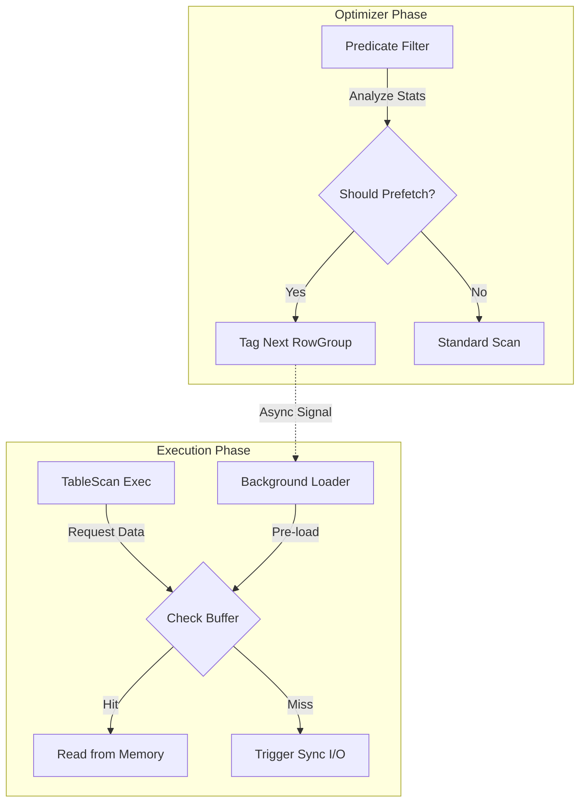
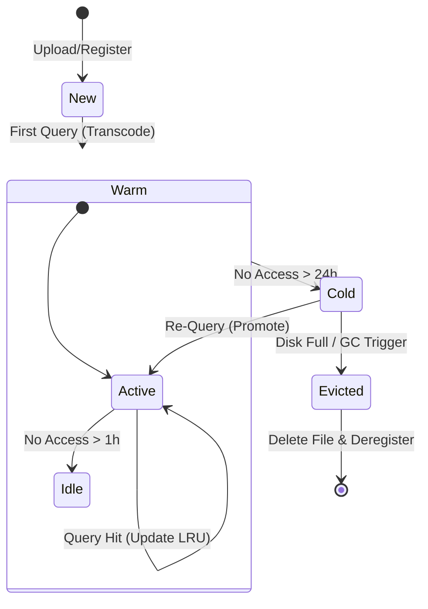

## ---

**5. 冷热数据管理与预取策略设计 (Cold/Hot Data Management Design)**

针对高性能查询场景，单纯依赖被动的按需加载（On-Demand Loading）往往存在 I/O 等待瓶颈。本节详细阐述冷热数据分层管理与智能预取（Prefetching）的逻辑设计，旨在通过主动的数据调度策略，最大化计算与 I/O 的并行度。

### **5.1 架构设计目标**

1.  **主动预热 (Active Warm-up)**: 利用谓词下推的统计信息，预测后续查询可能访问的数据块，并提前加载。
2.  **分层缓存 (Tiered Caching)**: 建立 "内存 (L1) -> 本地 Parquet 影子文件 (L2) -> 原始数据源 (L3)" 的三级存储结构。
3.  **自动老化 (Automatic Aging)**: 基于 LRU (Least Recently Used) 或频率衰减算法，自动识别并清理冷数据。

### **5.2 智能预取机制 (Smart Prefetching Logic)**

该机制挂载于 `OptimizerRule` 层，是对现有 `PushDownFilter` 的逻辑扩展。

*   **逻辑流程**:
    1.  **统计分析**: 当 `PushDownFilter` 识别到某个 `RowGroup` 包含目标数据时，分析其相邻 `RowGroup` 的元数据（Min/Max 统计）。
    2.  **相关性判定**: 如果相邻 `RowGroup` 的统计范围与当前查询谓词有交集（或属于高频访问的时间序列），则标记为 "High Potential"。
    3.  **异步预取**: 在执行当前 `RowGroup` 扫描的同时，向 `IO_Thread` 发送低优先级的读取请求，将相邻数据块加载到 `PrefetchBuffer`。
    4.  **无缝切换**: 当 `TableScan` 算子完成当前块处理请求下一块时，优先检查 `PrefetchBuffer`，实现 CPU 流水线零气泡。

#### **预取数据流图 (Prefetch Data Flow)**

### **5.3 缓存淘汰与清理逻辑 (Cache Eviction & Cleanup)**

为了防止缓存无限膨胀，必须实施严格的生命周期管理。这主要针对 L2 缓存（如转码后的 Parquet 影子文件）和 L1 内存池。

*   **清理策略**:
    1.  **容量阈值 (Capacity Threshold)**: 设定缓存最大占用空间（如磁盘 10GB，内存 2GB）。
    2.  **淘汰算法 (Eviction Algorithm)**: 采用 **LRU-K** (K=2) 算法。
        *   **访问追踪**: 每次查询命中影子文件或内存块时，更新其 `LastAccessTime` 和 `AccessCount`。
        *   **冷热分离**: `AccessCount > K` 进入热队列（受保护），否则在冷队列（优先淘汰）。
    3.  **后台清理任务 (Background GC)**:
        *   定期扫描（如每 1小时）`.shadow.parquet` 文件。
        *   **规则**: `CurrentTime - LastAccessTime > TTL (e.g. 24h)` OR `DiskUsage > 80%`。
        *   **动作**: 删除最旧的文件，并从 `MetadataStore` 中移除对应的 `parquet` 注册信息，回退到原始数据源（CSV/Excel）。

#### **缓存状态流转图 (Cache Lifecycle)**

