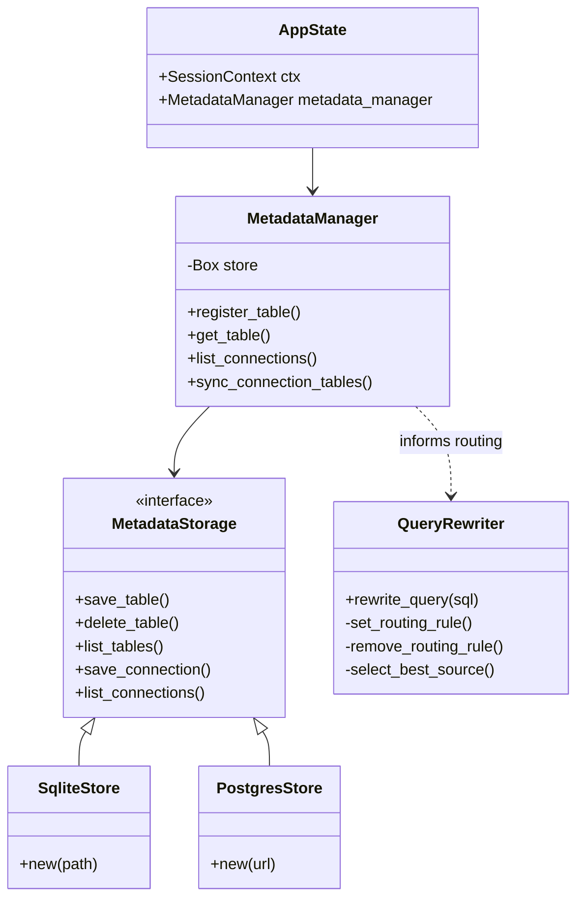
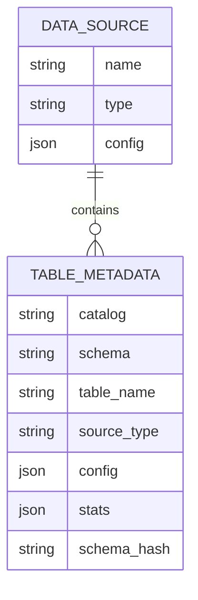
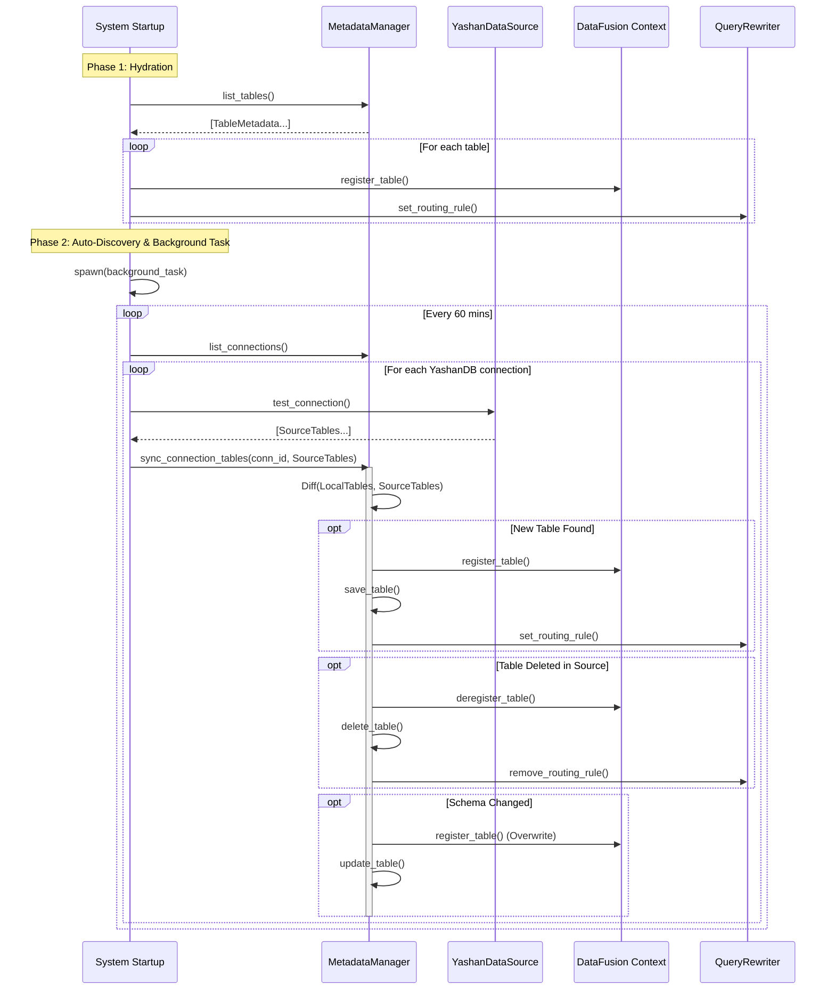

# Federated Query Engine - Metadata Architecture

## 1. 架构概览 (Architecture Overview)

本系统采用**元数据驱动 (Metadata-Driven)** 的架构设计，通过集中式元数据管理实现多源异构数据的统一查询。核心组件包括 `MetadataManager`（元数据管理）、`QueryRewriter`（查询重写与路由）、`DataSource`（数据源适配）以及 `DataFusion`（计算引擎）。

### 1.1 核心组件关系 (Core Components)



## 2. 元数据模型 (Metadata Model)

元数据存储主要包含以下实体：

- **data_sources**: 定义连接配置 (Connection Config)。
- **tables**: 定义逻辑表与物理表的映射 (Table Mapping)。
- **columns**: (可选) 列级元数据。

### 2.1 实体关系图 (ER Diagram)



## 3. 核心流程 (Core Processes)

### 3.1 启动与自动发现 (Startup & Auto-Discovery)

系统启动时采用"混合同步策略"：
1. **Hydration (热加载)**: 加载已持久化的元数据。
2. **Auto-Discovery (自动发现)**: 针对 YashanDB 等源，进行实时自省。
3. **Background Refresh (后台刷新)**: 启动后台任务定期同步。



## 4. 路由与多源策略 (Routing & Multi-Source)

### 4.1 命名空间管理
为了避免表名冲突，系统采用 **Scoped Naming** 策略：
- **逻辑表名 (Logical Name)**: 用户视角的表名，如 `bmsql_warehouse` 或 `User.BMSQL_WAREHOUSE`。
- **物理表名 (Scoped Name)**: DataFusion 中注册的唯一表名，格式为 `yashan_{schema}_{table}` (全小写)，例如 `yashan_user_bmsql_warehouse`。

### 4.2 路由规则
`QueryRewriter` 维护一个内存路由表：
- `bmsql_warehouse` -> `yashan_user_bmsql_warehouse`
- `user.bmsql_warehouse` -> `yashan_user_bmsql_warehouse`

## 5. 元数据同步策略 (Synchronization Strategy)

针对用户提出的"同步时间差"与"多数据源"挑战，采用以下组合策略：

| 策略 | 机制 | 适用场景 | 优缺点 |
| :--- | :--- | :--- | :--- |
| **启动全量同步** | 系统启动时扫描所有连接 | 服务重启 | ✅ 数据全 ❌ 启动慢 |
| **后台定期刷新** | `tokio::spawn` 每一小时扫描一次 | 长期运行的一致性 | ✅ 自动化 ❌ 有延迟窗口 |
| **全量对齐闭环** | 对比源端与本地元数据 | 处理表删除与变更 | ✅ 解决脏数据 ❌ 成本较高 |

### 5.1 后台定期刷新机制
当前已实现后台自动刷新任务 (`run_auto_discovery_task`)：
- **频率**: 默认 1 小时 (3600s)。
- **逻辑**: 遍历连接 -> 自省 -> 检查 `ctx.table_exist` -> 注册缺失表。
- **一致性**: 保证了新增表最终一致性 (Eventual Consistency)。

### 5.2 全量对齐与闭环机制 (Full Reconciliation & Closed Loop)
为了解决“源端删除”或“Schema 变更”无法即时感知的问题，系统在后台刷新任务中引入 **Diff & Sync** 逻辑：

1.  **获取快照**:
    *   $T_{source}$: 通过 `test_connection` 获取源端当前所有表列表。
    *   $T_{local}$: 通过 `MetadataManager` 获取该连接下已注册的表列表。
2.  **计算差异**:
    *   **新增 ($T_{add} = T_{source} - T_{local}$)**: 执行注册流程。
    *   **删除 ($T_{del} = T_{local} - T_{source}$)**: 执行注销流程 (Deregister DataFusion, Delete Metadata, Remove Routing)。
    *   **更新 ($T_{update}$)**: 对比 Schema Hash 或统计信息 (Rows)，若差异较大则重新注册。
3.  **闭环回调**: 自动修正元数据后，可选择触发回调接口通知外部系统（如有）。

```mermaid
flowchart TD
    A[Start Sync Task] --> B[List Connections]
    B --> C{Iterate Connection}
    C -->|Next| D[Introspect Source Tables (T_src)]
    C -->|Done| Z[End]
    D --> E[Get Local Tables (T_loc)]
    E --> F[Calculate Diff]
    F --> G{Diff Type}
    G -->|T_src only| H[Register New Table]
    G -->|T_loc only| I[Unregister Deleted Table]
    G -->|Both| J[Check Schema/Stats Drift]
    J -->|Changed| K[Update Table Metadata]
    J -->|Same| L[Skip]
    H --> C
    I --> C
    K --> C
    L --> C
```

## 7. 可插拔元数据存储 (Pluggable Metadata Storage)

为了应对企业级大规模元数据存储需求，系统设计了 `MetadataStorage` Trait，支持从默认的 SQLite 切换到 PostgreSQL、MySQL 等大型数据库。

### 7.1 接口定义 (Trait Definition)

```rust
#[async_trait]
pub trait MetadataStorage: Send + Sync {
    async fn save_table(&self, table: &TableMetadata) -> Result<()>;
    async fn delete_table(&self, catalog: &str, schema: &str, table: &str) -> Result<()>;
    async fn list_tables(&self) -> Result<Vec<TableMetadata>>;
    
    async fn save_connection(&self, conn: &ConnectionMetadata) -> Result<()>;
    async fn list_connections(&self) -> Result<Vec<ConnectionMetadata>>;
    // ...
}
```

### 7.2 实现策略
- **Default**: `SqliteMetadataStore` (嵌入式，适合中小规模)
- **Enterprise**: `PostgresMetadataStore` (连接池，适合百万级元数据)
- **Config**: 在 `config.toml` 或环境变量中指定 `METADATA_STORE_TYPE=postgres`。

## 6. 开发与扩展指南

### 6.1 添加新数据源
1. 实现 `DataSource` trait。
2. 在 `MetadataManager` 中注册连接配置。
3. 确保 `test_connection` 方法返回标准元数据。

### 6.2 调试
- 查看日志: `/api/logs`
- 检查已注册表: `/api/tables`
- 强制刷新: 重启服务 (或等待后台周期)
