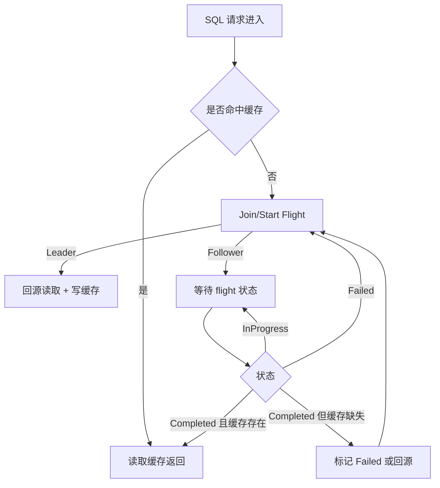

# TPCC Join Query Plan Analysis

## Query
```sql
SELECT w.w_id, 
        w.w_name, 
        d.d_id, 
        d.d_name, 
        h.h_date, 
        h.h_amount 
 FROM   tpcc.bmsql_warehouse  w 
 JOIN   tpcc.bmsql_district   d ON d.d_w_id = w.w_id 
 JOIN   tpcc.bmsql_history    h ON h.h_w_id = w.w_id 
                                AND h.h_d_id = d.d_id
```

## Expected Execution Flow

1.  **Query Rewriting & Source Selection (CBO)**
    *   **Input**: `tpcc.bmsql_warehouse`, `tpcc.bmsql_district`, `tpcc.bmsql_history`.
    *   **Logic**:
        *   The engine looks up these tables in the metadata registry.
        *   It finds candidates (e.g., `oracle_tpcc_bmsql_warehouse`, `yashandb_tpcc_bmsql_warehouse`).
        *   It groups them by source (Oracle vs YashanDB).
        *   It compares costs (sum of `NUM_ROWS`).
        *   **Goal**: Select the source with the lowest cost (or defaults to the first complete source).
    *   **Rewriting**:
        *   The SQL is rewritten to use physical table names (e.g., `SELECT ... FROM oracle_tpcc_bmsql_warehouse ...`).

2.  **Pushdown Optimization (Single Source)**
    *   If all tables belong to the *same* source (e.g., all Oracle), the engine should **push down** the entire join query.
    *   **Expected Plan**:
        ```
        Projection: ...
          TableScan: oracle_tpcc_bmsql_warehouse projection=[...], full_filters=[...]
        ```
        *Actually, with "Single Source Pushdown", the TableScan should wrap the entire SQL.*
    *   **Mechanism**:
        *   DataFusion's `TableProvider` (`OracleTable`) detects that the query structure allows pushdown.
        *   Or, the `OracleExec` node executes the full SQL string directly.

## Potential Issues ("Identifies Wrong Table/Cache")

1.  **Routing/Naming Ambiguity**:
    *   If `tpcc` is treated as a schema in one source but part of the table name in another, the rewriter might fail to match.
    *   If both Oracle and YashanDB are present, the CBO might be picking the "wrong" one (e.g., picking YashanDB when it should pick Oracle, or vice versa) due to missing or zero stats.
    *   *Correction*: Ensure `ANALYZE` or `EXPLAIN` stats are populated so CBO makes the right choice.

2.  **Cache/Link Consistency**:
    *   "Wrong Cache": If Zero-Copy Linking is active, `oracle_table` might be linked to `yashandb_table`'s cache.
    *   If the link is invalid (tables not identical), it reads wrong data.
    *   **Check**: Verify `/api/link_tables` status.

3.  **Plan Visualization**:
    *   The user suspects the execution plan is abnormal.
    *   We need to verify if it's doing a **Local Join** (bad performance, wrong cache usage?) vs **Pushdown Join** (good).

## Debugging Steps

1.  **Generate Plan**: Run `EXPLAIN` on the query.
2.  **Check CBO Logs**: Look for "CBO Selected Best Source".
3.  **Verify Stats**: Check if `NUM_ROWS` is correct for candidates.

## 本地缓存阻塞问题与修复建议（仅文档）

### 问题现象
- SQL 下来后卡在本地缓存阶段，无法进入数据源读取、成本计算与下推执行。
- 日志通常出现 Completed + 缓存缺失的提示，但流程不再推进。

### 关键代码路径
- Follower 单飞等待循环：在 Completed 但缓存缺失时继续等待，且不会再触发状态变化。
- 位置：[sqlite.rs](file:///e:/YDC/YDC/federated_query_engine/src/datasources/sqlite.rs#L302-L357)

### 机制原因（逻辑层面）
- Completed 表示写缓存已完成，但缓存可能尚不可读或写入失败。
- Follower 在 Completed 分支遇到 L1/L2 都缺失时，只记录日志并继续等待同一个 receiver 的下一次状态变化。
- Completed 之后状态不会再变化，导致等待永久阻塞。

### 修复方向（不改业务逻辑，仅修状态机）
1. **Completed + 缓存缺失时，改为 Failed 并重入 flight**
   - 目标：确保出现缓存缺失时，Follower 可转为 Leader 重新回源。
   - 等价方案：直接回源读取或显式返回错误，避免等待。

2. **Follower 等待增加超时或最大重试次数**
   - 目标：避免 InProgress/Completed 无变化导致永久等待。
   - 策略：超时后强制转为 Leader 或回源。

3. **Completed 的触发与缓存可读严格绑定**
   - 目标：只有 L1/L2 可读时才 mark_completed。
   - 否则 mark_failed，允许 Follower 重入。

### 推荐修复链路图（Mermaid）


### 验证点（不改代码的对齐项）
- Completed 日志出现后，L1/L2 是否可读。
- Follower 是否会在 Completed 且缓存缺失时回源或转 Leader。
- 观察是否仍出现“等待无变化”的 hang 现象。

## Reproduction Script (Planned)
Creating `tests/debug_plan.rs` to simulate the environment and dump the plan.
